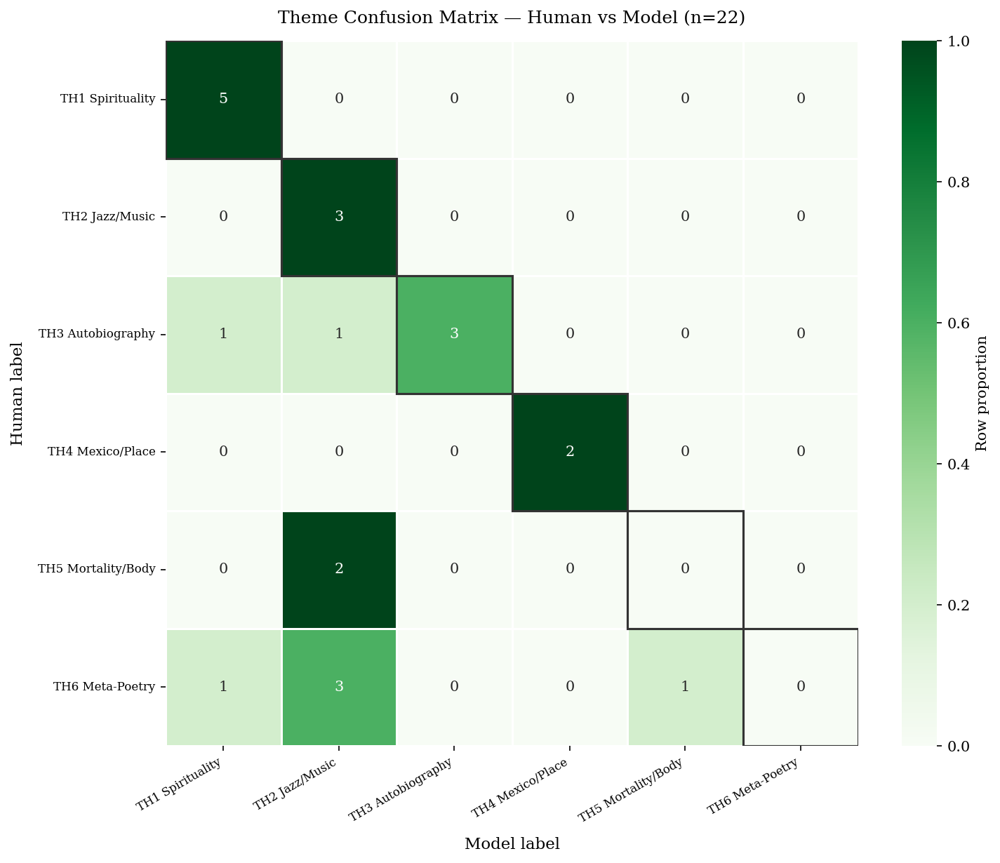
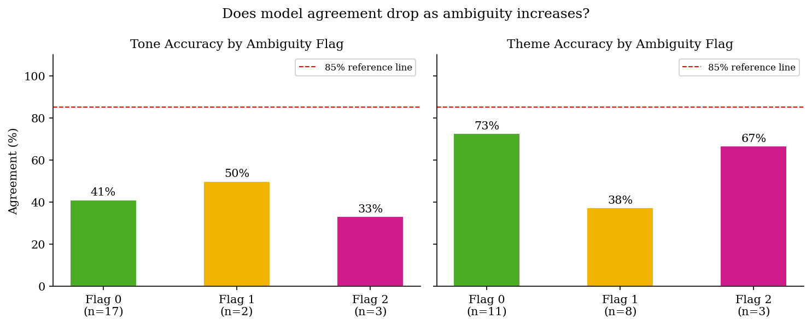

# Project Analysis

## Evaluating an LLM as a Structured Text Annotator

This project tested whether a locally deployed large language model could
act as a reliable annotator for a complex, interpretation-heavy text. The
case study used Jack Kerouac's *Mexico City Blues*, but the underlying
problem is broader: when can an LLM convert unstructured language into
consistent categories, and when does the task still require contextual
human judgement?

The central finding is that model reliability was conditional on how a
category was expressed. Mistral 7B performed best when the relevant signal
was visible in vocabulary. It was substantially less reliable when
classification depended on syntax, pacing, typography, irony or the
relationship between different parts of a text.

## Research Questions

1. How reliably can a locally run LLM classify the dominant emotional tone
   and theme of each text unit when compared with a human annotator using
   the same coding scheme?
2. Where do the model's classifications diverge most sharply from
   contextual human judgement?

## Evaluation Design

The project followed a Machine-Assisted Quantitizing Design: qualitative
interpretive categories were converted into structured labels, applied
across the corpus, evaluated quantitatively and then returned to
qualitative analysis.

- **Corpus:** 244 choruses, including the three-part 216th chorus
- **Model:** Mistral 7B, deployed locally through Ollama
- **Task:** closed-set classification
- **Labels:** five tone categories and six theme categories
- **Human benchmark:** a stratified 22-chorus gold standard
- **Outputs:** one dominant tone and one dominant theme per chorus
- **Metrics:** accuracy, Cohen's kappa, per-class precision, recall and F1
- **Diagnostics:** confusion matrices, disagreement analysis, ambiguity
  flags and structural test cases

The gold standard deliberately sampled structurally and interpretively
difficult parts of the corpus. Each human annotation included an ambiguity
flag:

- `0`: a clear primary label
- `1`: a defensible dual reading
- `2`: a structurally undecidable case

This prevented every disagreement from being treated automatically as
model error. Some disagreements can instead reveal that a single-label
classification scheme is simplifying genuinely unstable material.

## Reliability Results

| Dimension | Correct | Accuracy | Cohen's kappa | Interpretation |
|---|---:|---:|---:|---|
| Tone | 9/22 | 40.9% | 0.261 | Fair agreement |
| Theme | 13/22 | 59.1% | 0.506 | Moderate agreement |

Theme classification exceeded tone classification by more than 18
percentage points. This difference was not random. Several theme labels
had explicit lexical anchors, such as references to spirituality, music or
place. Tone labels more often required the model to interpret pacing,
syntactic movement, structural contrast or unresolved emotional shifts.

The result suggests that task definitions matter as much as model choice.
A label may appear conceptually clear to a human while remaining difficult
to operationalise from text alone.

## Prompt Stability Did Not Equal Accuracy

Before running the full annotation, I tested two controlled prompt
variants on 20 choruses. The variants replaced two terms in the coding
scheme while leaving the task and structure unchanged. Tone and theme
labels were stable in all 20 cases.

This 100% consistency showed that the deterministic pipeline was not
highly sensitive to those wording changes. It did **not** show that the
labels were correct. The gold-standard comparison remained necessary.

This distinction is important in applied AI evaluation: repeatability
measures whether a system gives the same answer, while validity measures
whether that answer is defensible.

## Finding 1: Vocabulary Was Easier Than Structure

The strongest-performing categories had identifiable semantic fields. The
place category achieved perfect F1 in the gold-standard sample, while the
spirituality category achieved perfect recall. By contrast, the model
achieved zero recall on four categories that depended more heavily on
tone, structure or context.

The clearest general pattern was:

- explicit lexical signal -> stronger classification
- contextual or relational signal -> weaker classification
- visual or typographic signal -> severe failure

This pattern explains why theme classification was more successful than
tone classification. The model could identify what vocabulary was present
more reliably than what that vocabulary was doing within the larger
structure.

## Finding 2: The Model Developed Category Attractors

The confusion matrices revealed systematic over-assignment rather than
evenly distributed error.

For tone, the model recovered every true T2 case but also pulled examples
from four other tone classes into T2. Only four of the ten gold-standard
items labelled T2 by the model were actually T2 according to the human
annotation. Rapid language and sonic play appeared to attract the model
even when the broader tone was reflective, anxious, comic or dark.

Theme showed a similar pattern. The music category absorbed examples from
meta-poetry and mortality/body categories. The model appeared to treat
prominent musical language as decisive even where structural or contextual
evidence supported a different label.

Across the full corpus, the model assigned:

- T2 to 41.0% of choruses
- TH2 to 39.3% of choruses
- T4 to only 2.0% of choruses
- TH6 to only 1.6% of choruses

These skews reinforce the error analysis: salient surface features acted
as classification shortcuts.

## Finding 3: Ambiguity Required Cautious Interpretation

Theme agreement was 73% on unambiguous gold-standard cases and 38% on
dual-labelled cases. This supports the expectation that a single-label
model will struggle when more than one reading is defensible.

However, agreement rose to 67% for the three structurally undecidable theme
cases. Because that subgroup contained only three examples, the apparent
rebound is not stable enough to support a strong claim.

The ambiguity analysis therefore provides a useful signal, not a
conclusive result. It also demonstrates why evaluation should report
sample sizes and uncertainty instead of reducing model quality to one
headline accuracy score.

## Finding 4: The Structural Test Failed Completely

Three "rest choruses" provided a focused test of whether the classifier
could recognise meaning carried by white space, stage directions and
structural absence. Human annotation assigned all three to the
meta-poetry category because their function depends on how they interrupt
the sequence.

The model identified none of them correctly: **0/3** were classified as
meta-poetry. Once the text was extracted into plain strings, the visual
space that produced the meaning was no longer available. The model
classified the remaining vocabulary instead.

This was not simply a random statistical error. It exposed a mismatch
between the information required by the task and the information supplied
to the model. A text-only pipeline cannot reliably classify a feature that
is encoded primarily through page layout.

## Implications for Applied AI

Although the dataset is literary, the evaluation lessons transfer to
commercial annotation, research operations and responsible AI:

1. **Define labels operationally.** Conceptually appealing categories may
   be unusable if annotators cannot identify stable textual signals.
2. **Benchmark against human judgement.** Deterministic output is not the
   same as valid output.
3. **Inspect per-class performance.** Overall accuracy can conceal
   categories with zero recall.
4. **Analyse systematic shortcuts.** Confusion matrices can expose
   repeated reliance on prominent but misleading features.
5. **Preserve relevant input modalities.** Meaning carried by layout,
   images or document structure may disappear during text extraction.
6. **Use human review selectively.** Vocabulary-grounded categories may be
   suitable for scaled first-pass annotation; contextual categories need
   stronger review.
7. **Treat disagreement as data.** Human-model divergence can identify
   ambiguous cases, weak taxonomies and missing context.

## Limitations

- **Small gold standard:** 22 examples are sufficient for exploratory
  evaluation but not for robust per-class estimates.
- **Single human annotator:** the benchmark reflects one informed reading
  and does not measure inter-annotator agreement.
- **Single model:** results cannot be generalised to other local or
  proprietary models without comparison.
- **Single-label reduction:** one dominant label simplifies texts that may
  intentionally hold several meanings at once.
- **Context restriction:** the model did not receive the biographical and
  critical context used by the human annotator.
- **Text-only representation:** extraction removed some visual and spatial
  information.

## Recommended Next Experiments

1. Expand the gold standard to 50-80 text units.
2. Recruit additional annotators and measure inter-annotator agreement.
3. Compare multiple local and proprietary models under the same prompt.
4. Ask the model to predict secondary labels and uncertainty.
5. Test whether a controlled contextual glossary improves performance.
6. Evaluate a multimodal or layout-aware pipeline on structurally encoded
   categories.
7. Compare model confidence with observed class-level error.

## Conclusion

Mistral 7B was a useful but uneven annotator. It provided scalable,
structured first-pass classification where categories were grounded in
visible vocabulary. It was not a reliable substitute for contextual human
interpretation when meaning depended on structure, pacing, irony,
typography or external knowledge.

The project therefore supports a human-in-the-loop model of AI-assisted
analysis: use models to structure and scale bounded tasks, measure their
errors explicitly, and retain human judgement for the cases where meaning
cannot be reduced to surface signals.

## Selected References

- Jones, James T. *A Map of Mexico City Blues: Jack Kerouac as Poet*.
  Southern Illinois University Press, 1992.
- Karjus, Andres. "Machine-Assisted Quantitizing Designs: Augmenting
  Humanities and Social Sciences with Artificial Intelligence."
  *Humanities and Social Sciences Communications*, 2025.
  [https://doi.org/10.1057/s41599-025-04503-w](https://doi.org/10.1057/s41599-025-04503-w)
- Landis, J. Richard, and Gary G. Koch. "The Measurement of Observer
  Agreement for Categorical Data." *Biometrics*, 1977.
  [https://doi.org/10.2307/2529310](https://doi.org/10.2307/2529310)
- Perron, Brian E., et al. "Moving Beyond ChatGPT: Local Large Language
  Models (LLMs) and the Secure Analysis of Confidential Unstructured Text
  Data in Social Work Research." *Research on Social Work Practice*, 2025.
  [https://doi.org/10.1177/10497315241280686](https://doi.org/10.1177/10497315241280686)
- Tornberg, Petter. "Best Practices for Text Annotation with Large
  Language Models." arXiv, 2024.
  [https://arxiv.org/abs/2402.05129](https://arxiv.org/abs/2402.05129)

## Supporting Materials

- [LLM annotation pipeline](notebooks/01_llm_annotation_pipeline.ipynb)
- [Model evaluation notebook](notebooks/02_model_evaluation.ipynb)
- [Label-only model outputs](outputs/annotations_labels_only.csv)
