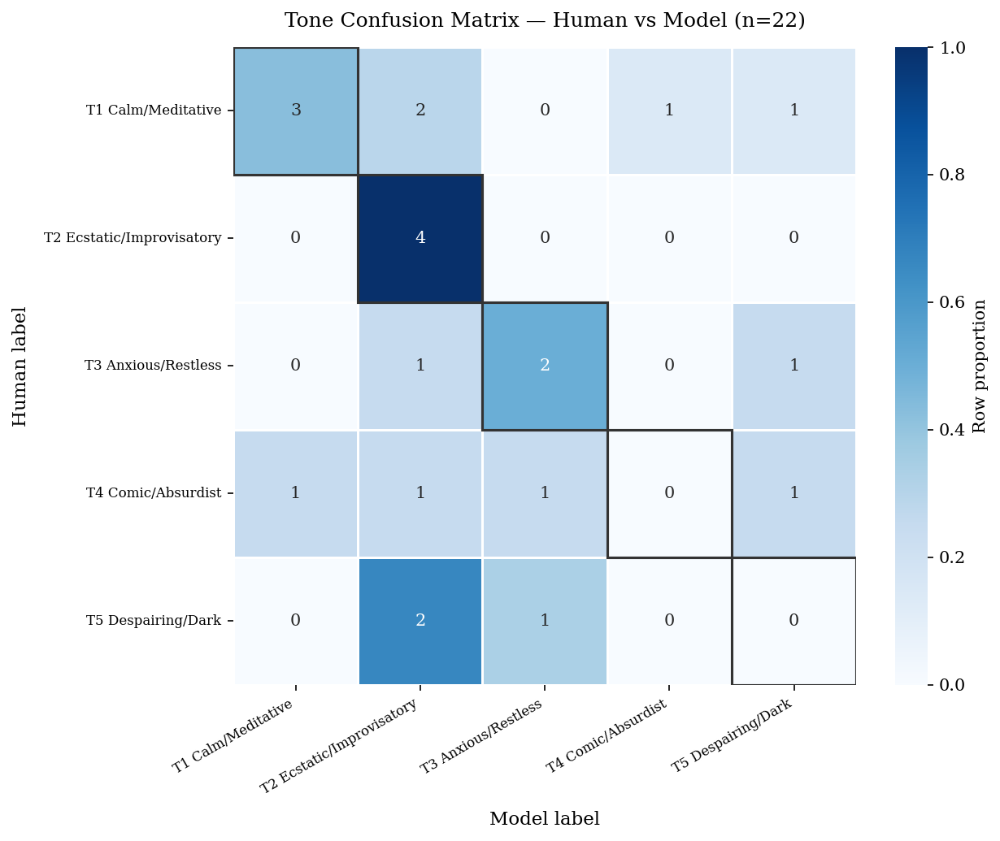

# Evaluating Mistral 7B as a Literary Text Annotator

An applied LLM evaluation project testing whether a locally deployed
language model can reliably classify tone and theme in complex literary
text.

## Project Overview

I used Mistral 7B through Ollama to annotate all 244 choruses of Jack
Kerouac's *Mexico City Blues*. The model performed closed-set
classification using five tone categories and six thematic categories.
Its outputs were compared with a 22-item human-annotated gold standard.

The project examines a practical question for AI evaluation: where can an
LLM support structured annotation, and where is human judgement still
required?

## Key Results

- Tone accuracy: **40.9%** (9/22)
- Tone Cohen's kappa: **0.261** (fair agreement)
- Theme accuracy: **59.1%** (13/22)
- Theme Cohen's kappa: **0.506** (moderate agreement)
- Tone disagreements: **13/22**
- Theme disagreements: **9/22**

The model identified some broad thematic patterns but struggled with
ambiguity, literary devices and context-dependent tone. Theme
classification was more reliable than tone classification, reinforcing
the need for task-specific validation and human review.



## Method

1. Validated and ordered a 244-unit literary corpus.
2. Designed a fixed-label coding scheme and structured system prompt.
3. Required JSON-only model responses for programmatic parsing.
4. Added validation, retry logic and checkpointing for failed outputs.
5. Conducted a prompt-sensitivity check before full annotation.
6. Compared model labels with a human gold standard.
7. Calculated accuracy, per-class precision, recall, F1 scores and
   Cohen's kappa.
8. Analysed confusion matrices, disagreements and ambiguity effects.

## Repository Structure

```text
notebooks/
  01_llm_annotation_pipeline.ipynb
  02_model_evaluation.ipynb
data/
  README.md
outputs/
  annotations_labels_only.csv
  figures/
requirements.txt
```

## Notebooks

- [LLM annotation pipeline](notebooks/01_llm_annotation_pipeline.ipynb)
- [Model evaluation and analysis](notebooks/02_model_evaluation.ipynb)

## Tools

Python, pandas, scikit-learn, Matplotlib, Seaborn, Jupyter, Ollama and
Mistral 7B.

## Reproducing the Workflow

```bash
python -m venv .venv
source .venv/bin/activate
pip install -r requirements.txt
ollama pull mistral
jupyter notebook
```

Place a legally obtained source corpus in `data/` following the schema in
[the data documentation](data/README.md), then run the notebooks in
numerical order.

## Data Responsibility

The copyrighted literary corpus and raw model responses are not
distributed. This repository contains the analysis code, label-only
derived results, evaluation outputs and documentation needed to understand
the methodology.

## Recognition

Completed for the MA Digital Humanities at King's College London and
awarded Distinction. Written feedback identified the project as making a
genuine contribution to LLM-supported literary annotation, with potential
for development into a conference or journal submission.

